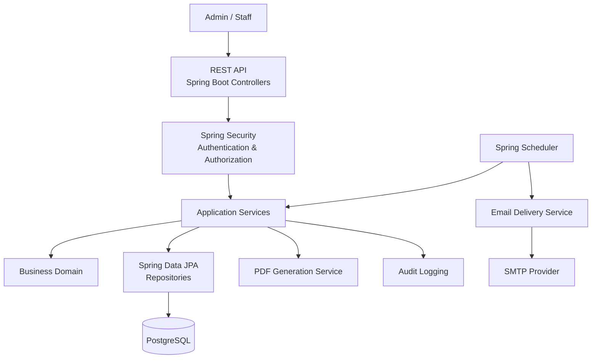
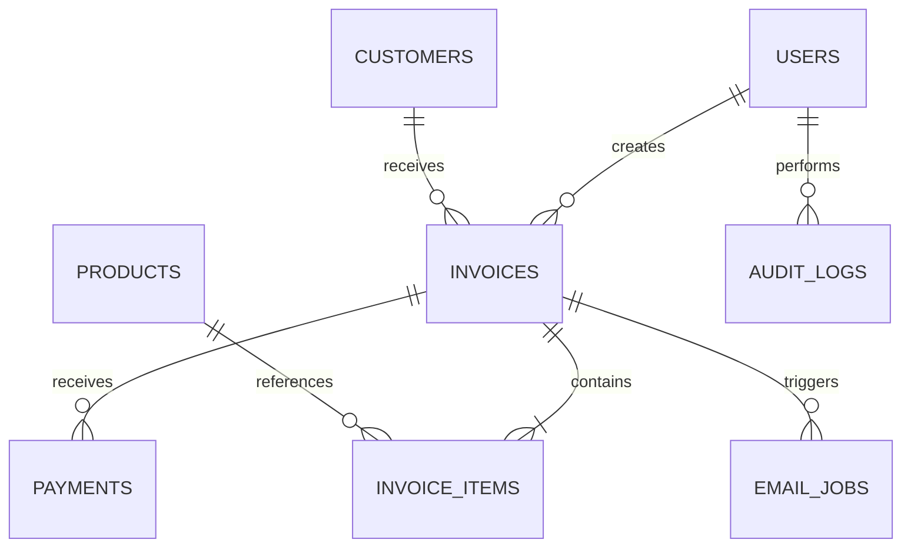
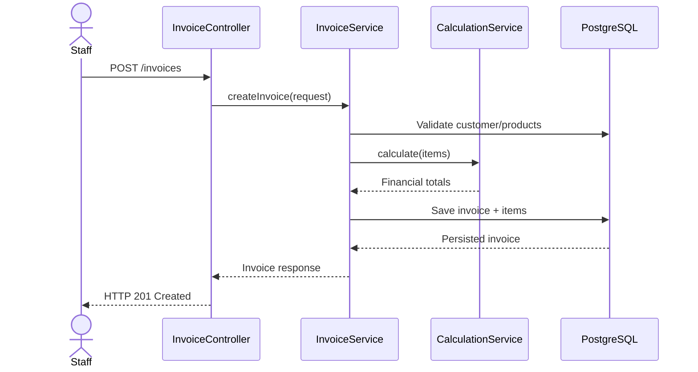
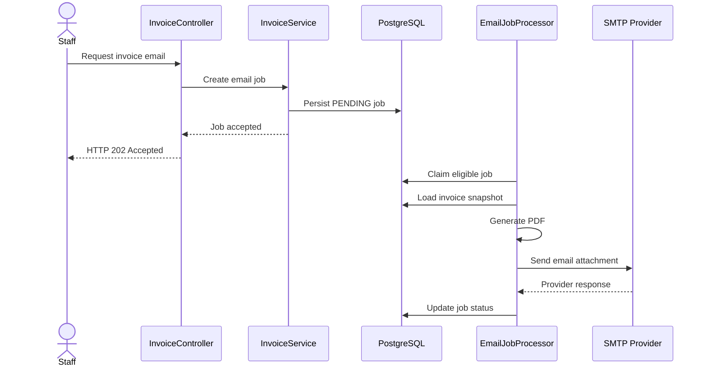
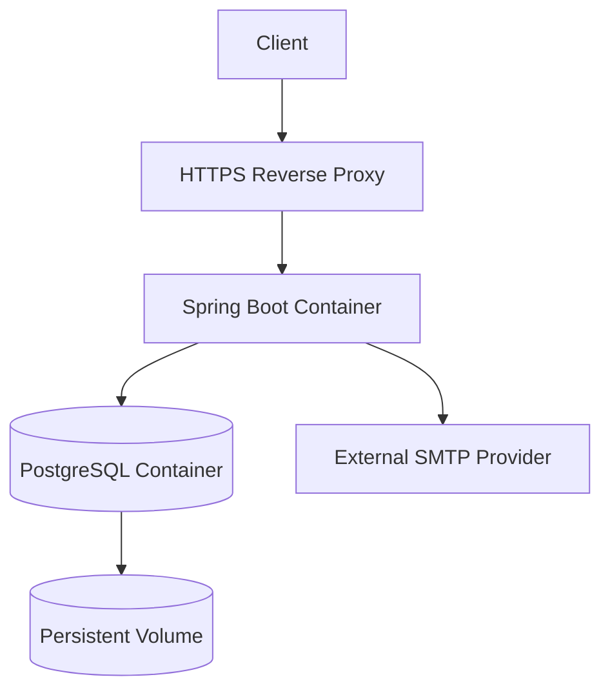

# SMART INVOICE — SYSTEM ARCHITECTURE

**Project Name:** Smart Invoice — Automated Invoice Management System  
**Document Type:** Software Architecture Document (SAD)  
**Version:** 1.0  
**Status:** Draft  
**Date:** 28/09/2026  
**Architecture Style:** Modular Monolith + Layered Architecture  
**Technology Stack:** Java 21, Spring Boot, PostgreSQL, Docker

**Related Documents:**

- 01-PROJECT-SCOPE.md
- 02-USER-STORIES.md
- 03-BUSINESS-RULES.md

---

## 1. Document Purpose

This document defines the technical architecture of the Smart Invoice system.

It describes the application's overall structure, business modules, communication patterns, persistence strategy, security architecture, deployment architecture, and engineering principles.

The architecture must support the initial MVP while allowing future extensions without requiring a complete system redesign.

This document serves as the primary technical reference for backend developers, database engineers, testers, and AI coding agents.

All implementation decisions must remain consistent with the approved business requirements.

---

## 2. Architectural Objectives

The system architecture must satisfy the following objectives.

## AR-01 — Maintainability

The application must be divided into clearly defined modules with explicit responsibilities.

Changes to one business module should minimize unintended effects on other modules.

## AR-02 — Data Integrity

Invoice creation, issuance, financial calculations, and payment recording must maintain transactional consistency.

## AR-03 — Security

Business data must be protected through authentication, authorization, input validation, and secure configuration.

## AR-04 — Reliability

Failures in external systems, such as email delivery, must not compromise successfully committed invoice transactions.

## AR-05 — Testability

Business calculations, state transitions, repositories, and API endpoints must support automated testing.

## AR-06 — Deployment Portability

The application must support containerized deployment using Docker and Docker Compose.

## AR-07 — Extensibility

The system should support future extensions such as payment gateways, additional currencies, reporting, and electronic tax-invoice integrations.

---

## 3. Architecture Decision

## 3.1 Selected Architecture

The Smart Invoice MVP uses:

**Modular Monolith Architecture combined with Layered Architecture.**

The system will initially be deployed as a single Spring Boot application.

Internally, the application will be divided into business-oriented modules.

Each module must have clearly defined responsibilities and interfaces.

## 3.2 Why Modular Monolith?

The initial system does not require independently deployed microservices.

A modular monolith provides:

- Simpler development.
- Easier debugging.
- Lower infrastructure complexity.
- Consistent database transactions.
- Reduced deployment overhead.
- Clear business-module boundaries.
- A foundation for future architectural evolution.

The initial application will use one PostgreSQL database.

Redis, message brokers, and microservices are not mandatory MVP dependencies.

## 3.3 Architectural Constraints

The following constraints apply:

- Controllers must not contain complex business logic.
- Business calculations must be implemented in dedicated services.
- Database access must be encapsulated by repositories.
- API DTOs must be separated from persistence entities.
- Modules must not introduce circular dependencies.
- External integrations must be abstracted behind interfaces.
- Database schema changes must be managed through Flyway.
- Sensitive configuration must not be hardcoded.

---

## 4. High-Level System Architecture



The diagram represents logical responsibilities rather than individual deployment units.

All internal business modules run within the same Spring Boot application during the MVP.

---

## 5. Application Layer Architecture

Each business module follows a layered design.

## 5.1 Controller Layer

Responsibilities:

- Receive HTTP requests.
- Validate request DTOs.
- Resolve authenticated users.
- Invoke application services.
- Return standardized API responses.

Controllers must not directly perform database operations.

Controllers must not contain financial calculation logic.

## 5.2 Application Service Layer

Responsibilities:

- Coordinate business workflows.
- Enforce business rules.
- Manage transactions.
- Invoke domain services.
- Access repositories.
- Coordinate internal module operations.

Examples:

- InvoiceService
- PaymentService
- CustomerService
- ProductService

## 5.3 Domain Layer

Responsibilities:

- Represent business concepts.
- Enforce domain invariants.
- Perform financial calculations.
- Validate invoice state transitions.
- Represent business statuses and value objects.

Examples:

- InvoiceStatus
- PaymentStatus
- InvoiceCalculationService
- Money
- InvoiceNumber

## 5.4 Repository Layer

Responsibilities:

- Persist domain data.
- Retrieve database records.
- Execute database queries.
- Support transactional consistency.

Database operations must use Spring Data JPA where appropriate.

Complex or performance-sensitive queries may use explicitly defined SQL.

## 5.5 Infrastructure Layer

Responsibilities:

- PostgreSQL integration.
- SMTP communication.
- PDF rendering.
- External service communication.
- Configuration.
- Background job execution.

Infrastructure implementation details must not unnecessarily leak into the business domain.

---

## 6. Module Architecture

The system is divided into the following modules.

| Module | Responsibility |
| --- | --- |
| Auth | Authentication and token management |
| Security | Authorization and security configuration |
| Customer | Customer information management |
| Product | Product and service catalogue |
| Invoice | Invoice creation and lifecycle |
| Payment | Payment recording and balances |
| PDF | Invoice document generation |
| Email | Invoice email delivery |
| Scheduler | Scheduled business operations |
| Audit | Business activity tracking |
| Common | Shared exceptions and API responses |
| Config | Application infrastructure configuration |

## 6.1 Auth Module

Responsibilities:

- Authenticate users.
- Validate credentials.
- Generate authentication tokens.
- Manage authentication-related operations.

Expected components:

- AuthController
- AuthService
- UserRepository
- LoginRequest
- LoginResponse

## 6.2 Customer Module

Responsibilities:

- Create customers.
- Update customer information.
- Retrieve customer records.
- Search and paginate customers.
- Validate customer information.

Expected components:

- CustomerController
- CustomerService
- CustomerRepository
- Customer
- CustomerRequest
- CustomerResponse

## 6.3 Product Module

Responsibilities:

- Manage products and services.
- Validate SKU uniqueness.
- Maintain product prices.
- Maintain applicable tax configuration.
- Prevent invalid catalogue modifications.

Expected components:

- ProductController
- ProductService
- ProductRepository
- Product
- ProductRequest
- ProductResponse

## 6.4 Invoice Module

Responsibilities:

- Create invoice drafts.
- Validate invoice items.
- Calculate financial values.
- Manage invoice lifecycle.
- Issue invoices.
- Generate unique invoice numbers.
- Preserve historical invoice snapshots.

Expected components:

- InvoiceController
- InvoiceService
- InvoiceCalculationService
- InvoiceValidationService
- InvoiceNumberService
- InvoiceRepository
- InvoiceItemRepository

The Invoice module is the central business module of the application.

It must not become a single large service containing all responsibilities.

## 6.5 Payment Module

Responsibilities:

- Record payments.
- Validate payment amounts.
- Prevent overpayments.
- Calculate outstanding balances.
- Update payment status.
- Preserve payment history.

Expected components:

- PaymentController
- PaymentService
- PaymentRepository
- Payment

## 6.6 PDF Module

Responsibilities:

- Retrieve finalized invoice information.
- Convert invoice data into document models.
- Render PDF documents.
- Support Vietnamese characters.
- Return generated document content.

Expected components:

- InvoicePdfService
- InvoicePdfRenderer
- InvoiceDocumentModel

The PDF module must use invoice snapshots rather than current product or customer data.

## 6.7 Email Module

Responsibilities:

- Prepare invoice email messages.
- Attach invoice PDFs.
- Communicate with SMTP providers.
- Track delivery jobs.
- Handle retries.

Expected components:

- InvoiceEmailService
- EmailJobRepository
- EmailJobProcessor
- EmailTemplateRenderer

## 6.8 Scheduler Module

Responsibilities:

- Execute scheduled tasks.
- Identify overdue invoices.
- Create reminder jobs.
- Process eligible background operations.

Scheduled tasks must be safe to execute repeatedly.

## 6.9 Audit Module

Responsibilities:

- Record important business events.
- Associate actions with users.
- Preserve relevant timestamps.
- Support operational investigation.

Sensitive credentials must not be logged.

---

## 7. Source Code Structure

The source code must follow a package-by-feature approach.

```text
smart-invoice/
│
├── src/
│   ├── main/
│   │   ├── java/com/smart-invoice/
│   │   │
│   │   │   ├── SmartInvoiceApplication.java
│   │   │
│   │   │   ├── auth/
│   │   │   │   ├── controller/
│   │   │   │   ├── service/
│   │   │   │   ├── dto/
│   │   │   │   └── repository/
│   │   │
│   │   │   ├── security/
│   │   │   │   ├── config/
│   │   │   │   ├── jwt/
│   │   │   │   └── filter/
│   │   │
│   │   │   ├── customer/
│   │   │   │   ├── controller/
│   │   │   │   ├── service/
│   │   │   │   ├── repository/
│   │   │   │   ├── entity/
│   │   │   │   ├── dto/
│   │   │   │   └── mapper/
│   │   │
│   │   │   ├── product/
│   │   │   │   ├── controller/
│   │   │   │   ├── service/
│   │   │   │   ├── repository/
│   │   │   │   ├── entity/
│   │   │   │   ├── dto/
│   │   │   │   └── mapper/
│   │   │
│   │   │   ├── invoice/
│   │   │   │   ├── controller/
│   │   │   │   ├── service/
│   │   │   │   ├── repository/
│   │   │   │   ├── entity/
│   │   │   │   ├── dto/
│   │   │   │   ├── mapper/
│   │   │   │   └── enums/
│   │   │
│   │   │   ├── payment/
│   │   │   │   ├── controller/
│   │   │   │   ├── service/
│   │   │   │   ├── repository/
│   │   │   │   ├── entity/
│   │   │   │   └── dto/
│   │   │
│   │   │   ├── pdf/
│   │   │   │   ├── service/
│   │   │   │   ├── renderer/
│   │   │   │   └── dto/
│   │   │
│   │   │   ├── email/
│   │   │   │   ├── service/
│   │   │   │   ├── repository/
│   │   │   │   ├── entity/
│   │   │   │   └── scheduler/
│   │   │
│   │   │   ├── scheduler/
│   │   │   ├── audit/
│   │   │   ├── common/
│   │   │   │   ├── exception/
│   │   │   │   ├── response/
│   │   │   │   └── validation/
│   │   │   └── config/
│   │   │
│   │   └── resources/
│   │       ├── application.yml
│   │       ├── application-local.yml
│   │       ├── application-prod.yml
│   │       ├── db/migration/
│   │       └── templates/
│   │
│   └── test/
│
├── docs/
├── Dockerfile
├── compose.yaml
├── .env.example
├── pom.xml
└── README.md
```

The directory structure may evolve, but module boundaries and separation of responsibilities must remain consistent.

---

## 8. API Architecture

The backend exposes RESTful APIs.

All business endpoints must use the following prefix:

/api/v1

Examples:

| Method | Endpoint | Responsibility |
| --- | --- | --- |
| POST | /api/v1/auth/login | Authenticate user |
| POST | /api/v1/customers | Create customer |
| GET | /api/v1/customers | List customers |
| POST | /api/v1/products | Create product |
| GET | /api/v1/products | List products |
| POST | /api/v1/invoices | Create draft invoice |
| GET | /api/v1/invoices/{id} | Retrieve invoice |
| POST | /api/v1/invoices/{id}/issue | Issue invoice |
| GET | /api/v1/invoices/{id}/pdf | Generate PDF |
| POST | /api/v1/invoices/{id}/send | Send invoice |
| POST | /api/v1/invoices/{id}/payments | Record payment |

## 8.1 Request Validation

Request validation must use Jakarta Bean Validation where applicable.

Examples:

- @NotNull
- @NotBlank
- @Email
- @Positive
- @PositiveOrZero

Cross-field and financial business validation must occur in the service/domain layer.

## 8.2 API Response Format

A successful JSON response should follow a consistent structure.

Example:

```json
{
  "success": true,
  "data": {
    "id": 1,
    "status": "DRAFT"
  },
  "message": "Invoice created successfully"
}
```

## 8.3 Error Response

Example:

```json
{
  "timestamp": "2026-09-28T10:00:00Z",
  "status": 400,
  "errorCode": "INVALID_INVOICE_QUANTITY",
  "message": "Invoice item quantity must be greater than zero",
  "path": "/api/v1/invoices"
}
```

Errors must be handled through a centralized GlobalExceptionHandler.

## 8.4 API Documentation

OpenAPI documentation must describe:

- Endpoints.
- Authentication requirements.
- Request DTOs.
- Response DTOs.
- Validation requirements.
- Error responses.

---

## 9. Database Architecture

PostgreSQL is the primary persistence system.

Spring Data JPA and Hibernate provide the initial ORM layer.

Flyway manages schema migrations.

## 9.1 Core Tables

The initial database contains:

- users
- customers
- products
- invoices
- invoice_items
- payments
- audit_logs
- email_jobs

Additional tables may be introduced when justified by business requirements.

## 9.2 Relationships



The detailed physical schema will be defined in 05-DATABASE-DRAFT.md and later implemented through Flyway migrations.

## 9.3 Financial Data Types

Java financial values must use BigDecimal.

PostgreSQL financial columns must use NUMERIC.

The initial MVP supports VND.

Currency precision and rounding must be handled explicitly.

## 9.4 Database Constraints

The database must enforce:

- Primary keys.
- Foreign keys.
- Unique product SKUs.
- Unique invoice numbers within the numbering scope.
- Valid non-negative monetary values where applicable.
- Required fields.
- Referential integrity.

## 9.5 Historical Snapshot Strategy

Issued invoices must preserve customer and product information.

Changing a customer or product record must not change historical invoice content.

Invoice snapshots must contain all information needed to regenerate the issued document.

---

## 10. Transaction Architecture

Financial operations must be transactional.

## 10.1 Invoice Creation

Invoice and invoice-item creation must occur atomically.

If any persistence operation fails, all related changes must be rolled back.

## 10.2 Invoice Issuance

Invoice validation, number assignment, snapshot finalization, and lifecycle updates must occur within a controlled transaction.

Duplicate issuance must be prevented.

## 10.3 Payment Recording

Payment creation and outstanding-balance updates must be transactionally consistent.

Concurrent requests must not result in overpayment.

## 10.4 External Operations

External operations must not hold database transactions open unnecessarily.

Examples:

- SMTP email delivery.
- Third-party API communication.
- Long-running PDF processing.

---

## 11. Invoice Processing Sequence



The invoice must initially be created as DRAFT.

Issuance is a separate business operation.

---

## 12. Email Processing Architecture

Email delivery must be decoupled from invoice issuance.

The MVP will use a database-backed email job mechanism.

A message broker is not required initially.

## 12.1 Email Job Workflow



## 12.2 Job Statuses

- PENDING
- PROCESSING
- SENT
- FAILED

## 12.3 Retry Mechanism

Failed jobs must support a bounded retry policy.

The initial target is three attempts with increasing delays.

Retry operations must not create additional invoice records.

The system should distinguish retryable errors from permanent delivery failures where possible.

## 12.4 Delivery Guarantee

The system must provide durable job persistence and safe retry handling.

Exactly-once email delivery cannot be guaranteed solely through SMTP.

The system must minimize duplicates through idempotency and delivery-job state management.

---

## 13. Security Architecture

Spring Security provides the authentication and authorization framework.

## 13.1 Authentication

The MVP will use token-based authentication.

The implementation must validate:

- Token authenticity.
- Token expiration.
- User identity.
- Account status.

## 13.2 Password Storage

Passwords must use secure adaptive hashing.

Plaintext passwords must never be persisted.

## 13.3 Authorization

Business operations must enforce role-based access control.

Administrative endpoints must require ADMIN permissions.

Staff access must be restricted according to approved authorization policies.

## 13.4 Sensitive Configuration

The following values must be externalized:

- Database credentials.
- Authentication signing secrets or private keys.
- SMTP credentials.
- Production-specific configuration.

Secrets must not be committed to the repository.

## 13.5 Logging

Authentication tokens, passwords, and secrets must not appear in application logs.

---

## 14. PDF Architecture

PDF generation must be implemented behind a dedicated service interface.

Suggested interface:

```java
public interface InvoicePdfService {
    byte[] generateInvoicePdf(Long invoiceId);
}
```

The PDF service must:

1. Validate invoice eligibility.
2. Retrieve the issued invoice snapshot.
3. Map invoice data into a document model.
4. Render the document.
5. Return generated PDF content.

The initial implementation may use OpenPDF or PDFBox.

The PDF renderer must support Unicode text and Vietnamese characters.

PDF generation must not alter finalized invoice data.

---

## 15. Deployment Architecture

Docker Compose will manage the initial deployment environment.

The MVP consists of:

- Spring Boot application container.
- PostgreSQL container.
- Persistent PostgreSQL volume.

A reverse proxy will be included in the staging/production deployment architecture.



## 15.1 Docker Requirements

- Use a multi-stage Dockerfile.
- Run the application as a non-root user.
- Externalize runtime configuration.
- Persist database storage.
- Configure container health checks.
- Use restart policies where appropriate.

## 15.2 Database Exposure

PostgreSQL must not be publicly exposed in production.

The application and database should communicate through an internal Docker network.

## 15.3 Environment Configuration

The system must support separate configurations for:

- Local development.
- Testing.
- Production.

Credentials must be supplied through environment variables or an approved secret-management mechanism.

---

## 16. Observability Architecture

The system must provide basic operational visibility.

## 16.1 Logging

Application logs should contain:

- Request identifiers.
- Relevant business operation identifiers.
- Error information.
- Job execution results.
- Business event references.

Sensitive information must be excluded.

## 16.2 Health Checks

Spring Boot Actuator will expose appropriate health endpoints.

Readiness and liveness checks should be configured for containerized deployment.

Sensitive Actuator endpoints must remain protected.

## 16.3 Metrics

Useful operational metrics include:

- API request volume.
- API error rate.
- Invoice creation failures.
- Email job failures.
- Scheduled job execution results.
- Database connection health.

---

## 17. Testing Architecture

Testing will use multiple levels.

## 17.1 Unit Testing

JUnit 5 and Mockito will test isolated business logic.

Primary targets:

- InvoiceCalculationService.
- InvoiceValidationService.
- Invoice state transitions.
- Payment validation.
- Discount and tax calculations.

## 17.2 Integration Testing

Testcontainers will provide an isolated PostgreSQL environment.

Integration tests must verify:

- Repository behavior.
- Database constraints.
- Flyway migrations.
- Transaction rollback.
- Concurrent financial operations.

## 17.3 API Testing

API tests must verify:

- Request validation.
- Response structure.
- HTTP status codes.
- Authentication.
- Authorization.
- Error handling.

## 17.4 End-to-End Testing

The primary workflow must be tested:

Customer creation → Product selection → Draft invoice → Calculation → Issuance → PDF → Email job → Payment recording.

---

## 18. Architecture Decision Records

Important technical decisions must be recorded as Architecture Decision Records (ADRs).

Suggested location:

docs/architecture/adr/

Initial decisions:

| ADR | Decision | Status |
| --- | --- | --- |
| ADR-001 | Use Modular Monolith | Accepted |
| ADR-002 | Use PostgreSQL | Accepted |
| ADR-003 | Use BigDecimal for money | Accepted |
| ADR-004 | Use Flyway migrations | Accepted |
| ADR-005 | Use Docker Compose for MVP | Accepted |
| ADR-006 | Use database-backed email jobs | Accepted |
| ADR-007 | Separate invoice and payment statuses | Accepted |

Future architectural changes must be documented.

---

## 19. Future Scalability

The initial architecture must support incremental extension.

Possible future improvements include:

- Redis caching.
- Dedicated background workers.
- Message broker integration.
- Object storage for documents.
- Payment gateway integration.
- Multi-tenant architecture.
- Dedicated reporting module.
- Electronic tax-invoice provider integration.
- Distributed tracing.
- Horizontal application scaling.

These capabilities must not be introduced prematurely without a justified requirement.

---

## 20. Architecture Acceptance Criteria

The architecture is considered ready for implementation when:

- All major business modules are identified.
- Responsibilities are clearly assigned.
- Controller, service, domain, and persistence boundaries are defined.
- Database access is encapsulated.
- Financial transaction boundaries are documented.
- Invoice and payment statuses are separated.
- Historical invoice snapshots are supported.
- External integrations are isolated.
- Email processing is decoupled from issuance.
- Security requirements are defined.
- Docker deployment is described.
- Testing responsibilities are documented.
- No unnecessary circular module dependencies exist.

---

## 21. Architecture Definition of Done

The architecture documentation is considered complete when:

1. It aligns with the approved Project Scope.
2. It covers all P0 User Stories.
3. It is consistent with the Business Rules.
4. Core modules have defined responsibilities.
5. Critical financial workflows have documented transaction boundaries.
6. Database requirements are identified.
7. Security and deployment requirements are specified.
8. Testing requirements are documented.
9. Major technical decisions are recorded.
10. The document is committed to Git.

---

**Document Status:** Initial System Architecture Defined.
