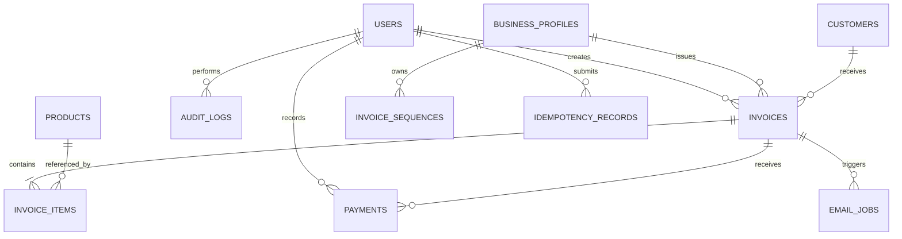

# SMART INVOICE — DATABASE DESIGN & ERD

**Project Name:** Smart Invoice — Automated Invoice Management System  
**Document Type:** Database Design Document (DDD)  
**Version:** 1.0  
**Status:** Draft — Pending Implementation  
**Date:** 28/09/2026  
**Database Engine:** PostgreSQL  
**ORM:** Spring Data JPA / Hibernate  
**Migration Tool:** Flyway  
**Architecture:** Modular Monolith

**Related Documents:**

- 01-PROJECT-SCOPE.md
- 02-USER-STORIES.md
- 03-BUSINESS-RULES.md
- 04-SYSTEM-ARCHITECTURE.md

---

## 1. Document Purpose

This document defines the logical and preliminary physical database design for the Smart Invoice application.

The database is responsible for maintaining accurate, consistent, and traceable records of:

- System users.
- Customers.
- Products and services.
- Invoice drafts and issued invoices.
- Invoice line items.
- Customer payments.
- Email delivery jobs.
- Business audit logs.
- Invoice numbering.
- Request idempotency.

The database design must support financial accuracy, transactional consistency, historical preservation, security, and future extensibility.

This document serves as the reference for:

- PostgreSQL schema implementation.
- Flyway database migrations.
- JPA Entity design.
- Repository development.
- Database constraints.
- Query optimization.
- Integration testing.
- Database backup and recovery.

The SQL schema will be implemented during the database development phase.

---

## 2. Database Design Objectives

The database architecture must satisfy the following objectives.

## DB-OBJ-001 — Data Integrity

All relationships must be enforced through appropriate primary keys, foreign keys, unique constraints, and check constraints.

## DB-OBJ-002 — Financial Accuracy

Financial values must use exact decimal representations.

Floating-point data types must not be used for monetary amounts.

## DB-OBJ-003 — Historical Preservation

Issued invoices must preserve the financial and billing information that existed at the time of issuance.

Changes to products, customers, or business information must not modify historical issued invoices.

## DB-OBJ-004 — Transactional Consistency

Related financial operations must execute atomically.

Incomplete or failed transactions must not leave inconsistent financial records.

## DB-OBJ-005 — Concurrency Safety

The database must prevent duplicate invoice issuance, duplicate payment recording, and invalid concurrent financial updates.

## DB-OBJ-006 — Auditability

Important financial and operational activities must be traceable.

## DB-OBJ-007 — Maintainability

Database changes must be managed through version-controlled Flyway migrations.

## DB-OBJ-008 — Performance

The database must support efficient customer search, product lookup, invoice filtering, payment retrieval, and scheduled job processing.

---

## 3. Database Technology

The primary database is PostgreSQL.

| Component | Technology |
| --- | --- |
| Database | PostgreSQL |
| ORM | Hibernate / Spring Data JPA |
| Migration | Flyway |
| Connection Pool | HikariCP |
| Primary Key | BIGINT / IDENTITY |
| Monetary Type | NUMERIC |
| Date-Time | TIMESTAMPTZ |
| Business Date | DATE |
| Concurrency | Optimistic / Pessimistic Locking |
| Deployment | Docker |
| Data Persistence | Docker Volume |

PostgreSQL is the authoritative source of persistent business data.

Redis is not required for the initial MVP.

---

## 4. Database Naming Conventions

The following naming rules must be followed.

## 4.1 Table Names

- Use lowercase letters.
- Use snake_case.
- Use plural names.

Examples:

- users
- customers
- products
- invoices
- invoice_items
- payments

## 4.2 Column Names

Use snake_case.

Examples:

- customer_id
- invoice_number
- created_at
- updated_at
- total_amount

## 4.3 Primary Keys

Primary keys use:

id BIGINT GENERATED BY DEFAULT AS IDENTITY

## 4.4 Foreign Keys

Foreign keys use the referenced entity name followed by `_id`.

Example:

customer_id

## 4.5 Constraint Names

Use descriptive names.

Examples:

- pk_invoices
- fk_invoices_customer
- uq_products_sku
- ck_payments_amount_positive

## 4.6 Index Names

Use the prefix:

idx_

Examples:

- idx_invoices_customer_id
- idx_invoices_due_date
- idx_email_jobs_status

---

## 5. Database Entity Overview

The initial database contains the following tables.

| Table | Responsibility |
| --- | --- |
| users | Authentication and staff information |
| customers | Customer information |
| products | Product and service catalogue |
| invoices | Invoice headers and financial totals |
| invoice_items | Detailed invoice line items |
| payments | Payment transactions |
| email_jobs | Asynchronous email delivery |
| audit_logs | Business activity tracking |
| invoice_sequences | Invoice number allocation |
| idempotency_records | Duplicate request prevention |
| business_profiles | Business issuer information |

The first eight tables represent the primary business model.

The remaining tables support invoice numbering, reliability, and historical business information.

---

## 6. Entity Relationship Diagram

The logical database relationships are defined below.



Note: A draft invoice may temporarily contain zero persisted items during an authorized editing transaction, but a committed invoice creation request and any issued invoice must contain at least one valid item. This requirement is enforced through application validation and transaction boundaries.

---

## 7. Table: users

## 7.1 Purpose

Stores authentication identities and account information for administrators and staff members.

## 7.2 Schema

| Column | Data Type | Constraint | Description |
| --- | --- | --- | --- |
| id | BIGINT | PK | User identifier |
| email | VARCHAR(255) | NOT NULL | Login email |
| password_hash | VARCHAR(255) | NOT NULL | Secure password hash |
| full_name | VARCHAR(150) | NOT NULL | User name |
| role | VARCHAR(30) | NOT NULL | ADMIN or STAFF |
| is_active | BOOLEAN | NOT NULL DEFAULT TRUE | Account status |
| created_at | TIMESTAMPTZ | NOT NULL | Creation timestamp |
| updated_at | TIMESTAMPTZ | NOT NULL | Last update |
| version | BIGINT | NOT NULL DEFAULT 0 | Optimistic locking |

## 7.3 Constraints

- Primary key on id.
- Case-insensitive email uniqueness.
- Role must belong to the supported role set.
- Password hash must not be empty.

Email uniqueness should use a normalized email representation or an appropriate case-insensitive unique index.

## 7.4 Business Rules

- Passwords must never be stored in plaintext.
- Disabled users cannot authenticate.
- Users referenced by financial records must not be physically deleted.
- Sensitive authentication information must never appear in API responses.

---

## 8. Table: customers

## 8.1 Purpose

Stores customer billing and contact information.

## 8.2 Schema

| Column | Data Type | Constraint | Description |
| --- | --- | --- | --- |
| id | BIGINT | PK | Customer identifier |
| customer_code | VARCHAR(50) | UNIQUE, NULLABLE | Optional internal customer code (not required by any user story) |
| name | VARCHAR(200) | NOT NULL | Customer name |
| email | VARCHAR(255) | NOT NULL | Email address |
| phone | VARCHAR(30) | NULL | Phone number |
| tax_code | VARCHAR(50) | NULL | Tax identification |
| billing_address | TEXT | NULL | Billing address |
| is_active | BOOLEAN | DEFAULT TRUE | Active status |
| created_at | TIMESTAMPTZ | NOT NULL | Creation timestamp |
| updated_at | TIMESTAMPTZ | NOT NULL | Update timestamp |
| version | BIGINT | DEFAULT 0 | Optimistic locking |

## 8.3 Business Rules

- Customer names must not be empty.
- Email addresses must be validated.
- Multiple customers may share the same email address.
- Historical invoice snapshots must remain unchanged when customer information changes.
- Customers referenced by financial records must be deactivated rather than hard-deleted.

---

## 9. Table: products

## 9.1 Purpose

Stores products and services available for invoice creation.

## 9.2 Schema

| Column | Data Type | Constraint | Description |
| --- | --- | --- | --- |
| id | BIGINT | PK | Product identifier |
| sku | VARCHAR(100) | NOT NULL, UNIQUE | Product code |
| name | VARCHAR(255) | NOT NULL | Product name |
| description | TEXT | NULL | Description |
| unit | VARCHAR(50) | NOT NULL | Unit of measurement |
| unit_price | NUMERIC(19,4) | NOT NULL | Unit price |
| tax_rate | NUMERIC(7,4) | NOT NULL | Applicable tax percentage |
| currency | VARCHAR(3) | NOT NULL DEFAULT 'VND' | Currency |
| is_active | BOOLEAN | DEFAULT TRUE | Availability |
| created_at | TIMESTAMPTZ | NOT NULL | Creation timestamp |
| updated_at | TIMESTAMPTZ | NOT NULL | Update timestamp |
| version | BIGINT | DEFAULT 0 | Optimistic locking |

## 9.3 Constraints

- SKU must be unique.
- Unit price must be non-negative.
- Tax rate must be between 0 and 100.
- Product name must not be empty.

## 9.4 Business Rules

Updating a product must not change historical issued invoice items.

Issued invoice items must retain product information through snapshots.

Products referenced by historical invoices should be deactivated instead of deleted.

---

## 10. Table: business_profiles

## 10.1 Purpose

Stores the information of the business issuing invoices.

The MVP supports one business organization.

The table is introduced to avoid hardcoding business information in PDF templates.

## 10.2 Schema

| Column | Data Type | Constraint |
| --- | --- | --- |
| id | BIGINT | PK |
| business_name | VARCHAR(255) | NOT NULL |
| tax_code | VARCHAR(50) | NULL |
| email | VARCHAR(255) | NULL |
| phone | VARCHAR(30) | NULL |
| address | TEXT | NULL |
| logo_path | TEXT | NULL |
| default_currency | VARCHAR(3) | NOT NULL |
| timezone | VARCHAR(100) | NOT NULL |
| created_at | TIMESTAMPTZ | NOT NULL |
| updated_at | TIMESTAMPTZ | NOT NULL |

## 10.3 Business Rules

- Only authorized administrators can modify business settings.
- Issued invoices must preserve the issuer information used at issuance.
- Updating the business profile must not modify previously issued invoices.

---

## 11. Table: invoices

## 11.1 Purpose

The invoices table is the central financial record of the Smart Invoice system.

It stores the invoice header, lifecycle status, customer reference, finalized totals, and historical snapshots.

## 11.2 Schema

| Column | Data Type | Constraint | Description |
| --- | --- | --- | --- |
| id | BIGINT | PK | Invoice ID |
| invoice_number | VARCHAR(50) | UNIQUE, NULLABLE | Official internal invoice number |
| business_profile_id | BIGINT | FK, NOT NULL | Issuing business |
| customer_id | BIGINT | FK, NOT NULL | Customer reference |
| created_by | BIGINT | FK, NOT NULL | Creator |
| invoice_status | VARCHAR(30) | NOT NULL | DRAFT / ISSUED / CANCELLED |
| payment_status | VARCHAR(30) | NOT NULL | UNPAID / PARTIALLY_PAID / PAID |
| currency | VARCHAR(3) | NOT NULL | Currency |
| subtotal | NUMERIC(19,4) | NOT NULL | Sum of line amounts |
| discount_amount | NUMERIC(19,4) | NOT NULL | Total discount |
| tax_amount | NUMERIC(19,4) | NOT NULL | Total tax |
| grand_total | NUMERIC(19,4) | NOT NULL | Final amount |
| paid_amount | NUMERIC(19,4) | NOT NULL DEFAULT 0 | Total valid payments |
| balance_due | NUMERIC(19,4) | NOT NULL | Outstanding balance |
| issued_at | TIMESTAMPTZ | NULL | Issuance timestamp (UTC) |
| issue_date | DATE | NULL | Issue date in the business timezone (printed on PDF, drives numbering year) |
| due_date | DATE | NULL | Payment deadline |
| notes | TEXT | NULL | Additional notes |
| customer_snapshot | JSONB | NULL | Historical customer information |
| issuer_snapshot | JSONB | NULL | Historical business information |
| created_at | TIMESTAMPTZ | NOT NULL | Creation timestamp |
| updated_at | TIMESTAMPTZ | NOT NULL | Update timestamp |
| version | BIGINT | NOT NULL DEFAULT 0 | Optimistic locking |

## 11.3 Constraints

- Invoice number must be unique when present.
- Grand total must be non-negative.
- Discount amount must be non-negative.
- Tax amount must be non-negative.
- Paid amount must be non-negative.
- Balance due must be non-negative.
- Paid amount must not exceed grand total.
- Balance due must equal grand total minus paid amount: `CHECK (balance_due = grand_total - paid_amount)`.
- Grand total must equal subtotal minus discount plus tax: `CHECK (grand_total = subtotal - discount_amount + tax_amount)`.
- Discount must not exceed subtotal.
- Invoice status must use supported values.
- Payment status must use supported values.
- An issued invoice must be complete: `CHECK (invoice_status <> 'ISSUED' OR (invoice_number IS NOT NULL AND issued_at IS NOT NULL AND issue_date IS NOT NULL AND customer_snapshot IS NOT NULL AND issuer_snapshot IS NOT NULL))`.
- The due date must not be before the issue date: `CHECK (due_date IS NULL OR issue_date IS NULL OR due_date >= issue_date)`.

For a DRAFT invoice, `paid_amount = 0`, `balance_due = grand_total`, and `payment_status = UNPAID`.

## 11.4 Draft Invoice Rules

A DRAFT invoice may have a null invoice_number.

Official numbering occurs during issuance.

Drafts must not consume official invoice numbers merely because they are created.

## 11.5 Issued Invoice Rules

An ISSUED invoice must contain:

- Unique invoice number.
- Issue timestamp.
- Customer snapshot.
- Issuer snapshot.
- Finalized financial totals.
- At least one valid invoice item.

The system must prevent direct financial modification after issuance.

## 11.6 Snapshot Example

```json
{
  "customerName": "Nguyen Van A",
  "email": "customer@example.com",
  "taxCode": null,
  "billingAddress": "Ho Chi Minh City",
  "snapshotVersion": 1
}
```

Snapshot structures must be versioned so that future schema changes do not prevent old invoice documents from being regenerated.

---

## 12. Table: invoice_items

## 12.1 Purpose

Stores each product or service included in an invoice.

Invoice items preserve the financial details used when the invoice is issued.

## 12.2 Schema

| Column | Data Type | Constraint |
| --- | --- | --- |
| id | BIGINT | PK |
| invoice_id | BIGINT | FK, NOT NULL |
| product_id | BIGINT | FK, NULLABLE |
| line_number | INTEGER | NOT NULL |
| sku_snapshot | VARCHAR(100) | NULL |
| name_snapshot | VARCHAR(255) | NOT NULL |
| description_snapshot | TEXT | NULL |
| unit_snapshot | VARCHAR(50) | NOT NULL |
| quantity | NUMERIC(19,4) | NOT NULL |
| unit_price | NUMERIC(19,4) | NOT NULL |
| line_amount | NUMERIC(19,4) | NOT NULL |
| discount_amount | NUMERIC(19,4) | NOT NULL DEFAULT 0 (allocated share of the invoice discount, BR-CAL-012) |
| taxable_amount | NUMERIC(19,4) | NOT NULL |
| tax_rate | NUMERIC(7,4) | NOT NULL |
| tax_amount | NUMERIC(19,4) | NOT NULL |
| line_total | NUMERIC(19,4) | NOT NULL |
| created_at | TIMESTAMPTZ | NOT NULL |

## 12.3 Constraints

- Quantity must be greater than zero.
- Unit price must be non-negative.
- Discount must be non-negative.
- Tax amount must be non-negative.
- Line total must be non-negative.
- Line number must be unique within each invoice: `UNIQUE (invoice_id, line_number)`.
- `line_total = taxable_amount + tax_amount` and `taxable_amount = line_amount - discount_amount`.
- Tax rate must be between 0 and 100.
- `invoice_items.product_id` must use `ON DELETE` restrict or no action; products are deactivated, never deleted.

## 12.4 Historical Preservation

The product_id column is only a reference to the original catalogue record.

The invoice item must preserve its own historical information.

A change to the products table must not affect issued invoice items.

---

## 13. Table: payments

## 13.1 Purpose

Stores payment transactions associated with issued invoices.

## 13.2 Schema

| Column | Data Type | Constraint |
| --- | --- | --- |
| id | BIGINT | PK |
| invoice_id | BIGINT | FK, NOT NULL |
| amount | NUMERIC(19,4) | NOT NULL |
| currency | VARCHAR(3) | NOT NULL |
| payment_method | VARCHAR(50) | NOT NULL |
| payment_reference | VARCHAR(150) | NULL |
| idempotency_key | VARCHAR(150) | UNIQUE, NOT NULL |
| status | VARCHAR(30) | NOT NULL DEFAULT 'COMPLETED' |
| paid_at | TIMESTAMPTZ | NOT NULL |
| recorded_by | BIGINT | FK, NOT NULL |
| created_at | TIMESTAMPTZ | NOT NULL |

## 13.3 Payment Record Status

The column is named `status` to avoid confusion with `invoices.payment_status`, which holds UNPAID, PARTIALLY_PAID, or PAID.

The initial payment record supports:

- COMPLETED
- REVERSED

Reversal functionality requires a separately defined business workflow before implementation.

The initial MVP primarily records completed payments.

## 13.4 Constraints

- Amount must be greater than zero.
- Currency must match the invoice currency.
- The idempotency key is globally unique in `payments`. This is a database backstop in addition to `idempotency_records`.
- Payment must reference an issued invoice. The service enforces this under the invoice row lock.
- Only COMPLETED payments count as valid payments in balance calculations.

## 13.5 Outstanding Balance

Outstanding Balance = Invoice Grand Total - Sum of Valid Payments

The payment operation must execute within a database transaction.

Concurrent payments must not create an invalid outstanding balance.

## 13.6 Source of Truth

The payments table is the authoritative record of payment transactions.

The paid_amount and balance_due fields in invoices are maintained summary values.

They must remain consistent with valid payment records.

---

## 14. Table: email_jobs

## 14.1 Purpose

Stores durable email delivery jobs.

Email delivery must be independent from the invoice issuance transaction.

## 14.2 Schema

| Column | Data Type | Constraint |
| --- | --- | --- |
| id | BIGINT | PK |
| invoice_id | BIGINT | FK, NOT NULL |
| recipient_email | VARCHAR(255) | NOT NULL |
| subject | VARCHAR(255) | NOT NULL |
| job_type | VARCHAR(50) | NOT NULL (INVOICE_DELIVERY, PAYMENT_REMINDER) |
| status | VARCHAR(30) | NOT NULL |
| attempt_count | INTEGER | NOT NULL DEFAULT 0 |
| max_attempts | INTEGER | NOT NULL DEFAULT 3 |
| next_attempt_at | TIMESTAMPTZ | NULL |
| processing_started_at | TIMESTAMPTZ | NULL |
| locked_until | TIMESTAMPTZ | NULL |
| idempotency_key | VARCHAR(150) | UNIQUE, NOT NULL |
| provider_message_id | VARCHAR(255) | NULL |
| last_error | TEXT | NULL |
| created_at | TIMESTAMPTZ | NOT NULL |
| updated_at | TIMESTAMPTZ | NOT NULL |
| sent_at | TIMESTAMPTZ | NULL |

## 14.3 Supported Job Statuses

- PENDING
- PROCESSING
- SENT
- FAILED

## 14.4 Processing Rules

- Jobs must be persisted before processing.
- Failed jobs may be retried.
- Retry count must be bounded.
- Workers must claim jobs safely.
- A failed job must not invalidate the issued invoice.
- Duplicate requests must not create duplicate jobs.

Workers claim jobs with `SELECT … FOR UPDATE SKIP LOCKED` in a short transaction and set `locked_until`. A PROCESSING job whose `locked_until` has passed may be reclaimed. SMTP calls run outside any database transaction. Status semantics are defined in BR-EMAIL-004.

## 14.5 Delivery Semantics

SMTP delivery is not guaranteed to be exactly once.

A job marked SENT indicates the provider accepted the message.

It does not prove that the recipient read the email.

---

## 15. Table: audit_logs

## 15.1 Purpose

Records important business operations for traceability.

## 15.2 Schema

| Column | Data Type | Constraint |
| --- | --- | --- |
| id | BIGINT | PK |
| actor_id | BIGINT | FK, NULLABLE |
| action | VARCHAR(100) | NOT NULL |
| entity_type | VARCHAR(100) | NOT NULL |
| entity_id | BIGINT | NULL |
| old_values | JSONB | NULL |
| new_values | JSONB | NULL |
| request_id | VARCHAR(100) | NULL |
| ip_address | INET | NULL |
| created_at | TIMESTAMPTZ | NOT NULL |

## 15.3 Audit Events

Examples:

- INVOICE_CREATED
- INVOICE_ISSUED
- INVOICE_CANCELLED
- PAYMENT_RECORDED
- CUSTOMER_UPDATED
- PRODUCT_UPDATED
- USER_ROLE_CHANGED

## 15.4 Security

Audit logs must not contain:

- Passwords.
- Authentication tokens.
- Signing secrets.
- SMTP credentials.

Audit records must not be freely editable through ordinary business APIs.

---

## 16. Table: invoice_sequences

## 16.1 Purpose

Coordinates invoice number allocation.

This table prevents invoice numbers from being generated through unsafe application-side calculations such as MAX(invoice_number) + 1.

## 16.2 Schema

| Column | Data Type | Constraint |
| --- | --- | --- |
| id | BIGINT | PK |
| business_profile_id | BIGINT | FK, NOT NULL |
| sequence_year | INTEGER | NOT NULL |
| last_value | BIGINT | NOT NULL DEFAULT 0 |
| updated_at | TIMESTAMPTZ | NOT NULL |

## 16.3 Constraints

Unique combination:

business_profile_id + sequence_year

`sequence_year` is the year of the invoice's `issue_date` in the business timezone (`business_profiles.timezone`).

Allocation uses `UPDATE invoice_sequences SET last_value = last_value + 1 … RETURNING last_value` (or a `SELECT … FOR UPDATE` followed by an update) inside the issuance transaction. A missing year row is created with `INSERT … ON CONFLICT DO NOTHING` first.

A PostgreSQL `SEQUENCE` must not be used, because its values are not rolled back and would leave gaps.

## 16.4 Invoice Number Format

Example:

INV-2026-000001

The actual format must be configurable.

## 16.5 Concurrency

Number allocation must occur inside a controlled transaction.

The system must lock or atomically update the relevant sequence record.

Invoice number uniqueness must also be enforced by the invoices table.

---

## 17. Table: idempotency_records

## 17.1 Purpose

Prevents duplicate business operations caused by repeated API requests.

## 17.2 Schema

| Column | Data Type | Constraint |
| --- | --- | --- |
| id | BIGINT | PK |
| actor_id | BIGINT | FK, NULLABLE |
| idempotency_key | VARCHAR(150) | NOT NULL |
| operation_type | VARCHAR(100) | NOT NULL |
| request_hash | VARCHAR(128) | NOT NULL |
| resource_type | VARCHAR(100) | NULL |
| resource_id | BIGINT | NULL |
| response_status | INTEGER | NULL |
| response_body | JSONB | NULL |
| status | VARCHAR(30) | NOT NULL |
| created_at | TIMESTAMPTZ | NOT NULL |
| expires_at | TIMESTAMPTZ | NULL |

## 17.3 Constraints

- `UNIQUE (operation_type, idempotency_key)`. The unique constraint, not an application-side check, is what prevents two concurrent requests with the same key from both executing.
- `status` values: IN_PROGRESS, COMPLETED, FAILED.

## 17.4 Rules

- Repeated equivalent requests must not repeat the same financial operation.
- Reusing a key with a different request payload must be rejected with HTTP 409 `IDEMPOTENCY_KEY_REUSED`.
- Concurrent requests with the same key must not both execute.
- Successful results may be replayed according to the API contract.

Supported operations include:

- Invoice issuance.
- Payment creation.
- Email delivery request.

---

## 18. Primary Key Strategy

The initial database uses BIGINT identity primary keys.

Example:

```sql
id BIGINT GENERATED BY DEFAULT AS IDENTITY PRIMARY KEY
```

Advantages:

- Simple JPA mapping.
- Compact indexes.
- Efficient database joins.
- Straightforward implementation.

If public identifiers must not expose sequential internal IDs, a separate UUID or public reference may be introduced.

Internal IDs must not be treated as authorization mechanisms.

---

## 19. Foreign Key Strategy

Foreign keys must enforce relational consistency.

Examples:

- invoices.customer_id → customers.id
- invoices.created_by → users.id
- invoice_items.invoice_id → invoices.id
- invoice_items.product_id → products.id
- payments.invoice_id → invoices.id
- email_jobs.invoice_id → invoices.id

Financial records must not use uncontrolled cascading deletion.

Application-level deletion rules must preserve historical data.

---

## 20. Indexing Strategy

The following indexes are proposed.

| Index | Columns | Purpose |
| --- | --- | --- |
| idx_customers_name | name | Customer search |
| idx_products_name | name | Product search |
| idx_invoices_customer_id | customer_id | Customer invoices |
| idx_invoices_status | invoice_status | Status filtering |
| idx_invoices_due_date | due_date | Overdue detection |
| idx_invoices_created_at | created_at | Chronological queries |
| idx_invoice_items_invoice_id | invoice_id | Invoice detail |
| idx_payments_invoice_id | invoice_id | Payment history |
| idx_email_jobs_status_next | status, next_attempt_at | Background jobs |
| idx_audit_logs_entity | entity_type, entity_id | Audit retrieval |

Additional indexes must be justified using actual query patterns.

Not every column requires an index.

Unique constraints already provide supporting indexes in PostgreSQL.

---

## 21. Financial Precision Strategy

Financial accuracy is mandatory.

Java must use BigDecimal.

PostgreSQL must use NUMERIC.

## 21.1 Monetary Columns

Proposed storage type:

NUMERIC(19,4)

The application must enforce the supported currency's business precision.

For VND, the initial policy uses whole-unit final monetary amounts.

Intermediate calculations may retain additional precision.

## 21.2 Tax Rates

Proposed storage type:

NUMERIC(7,4)

Tax rates are stored as percentage values.

Example:

10.0000 represents 10%.

The calculation service must consistently convert percentage values into decimal multipliers.

## 21.3 Rounding

The initial calculation policy uses:

RoundingMode.HALF_UP

Final monetary amounts for VND are stored rounded to scale 0, even though the columns allow scale 4. The allocation and rounding sequence is defined in BR-CAL-012.

The policy must be centralized rather than implemented independently in multiple services.

## 21.4 Reconciliation

The following must hold:

Subtotal = Sum of Line Amounts

Grand Total = Subtotal - Discount + Tax

Balance Due = Grand Total - Valid Payments

Financial totals must reconcile according to the configured rounding policy.

---

## 22. Transaction Strategy

## 22.1 Invoice Creation

Invoice header and items must be saved atomically.

## 22.2 Invoice Issuance

The following operations belong to the issuance transaction:

1. Validate invoice state.
2. Validate invoice items.
3. Finalize calculation.
4. Store historical snapshots.
5. Allocate invoice number.
6. Update invoice status.
7. Persist finalized invoice.

If any critical operation fails, the transaction must roll back.

## 22.3 Payment Recording

The following operations must remain consistent:

1. Validate payment request.
2. Lock or validate invoice version.
3. Check outstanding balance.
4. Insert payment record.
5. Update invoice payment summary.
6. Update payment status.

## 22.4 External Operations

SMTP delivery must execute outside the financial transaction.

A durable email job must be persisted before asynchronous processing begins.

---

## 23. Concurrency Control

The following scenarios require concurrency protection.

| Scenario | Protection |
| --- | --- |
| Two users issue one invoice | `SELECT … FOR UPDATE` on invoice + DRAFT re-check |
| Two invoices request sequence numbers | Atomic sequence allocation |
| Same payment request is retried | Idempotency |
| Two payments exceed remaining balance | `SELECT … FOR UPDATE` on invoice + CHECK constraints |
| Multiple workers claim one email job | `FOR UPDATE SKIP LOCKED` + `locked_until` |
| Same idempotency key sent concurrently | Unique `(operation_type, idempotency_key)` |
| Two users edit one draft | Optimistic locking |

PostgreSQL locking and database constraints are the final consistency boundary.

Application-level checks alone are insufficient.

---

## 24. Soft Delete Strategy

Financial records must not be physically deleted through ordinary application workflows.

Recommended policy:

| Entity | Deletion Policy |
| --- | --- |
| Users | Disable account |
| Customers | Deactivate |
| Products | Deactivate |
| Draft invoices | Cancel |
| Issued invoices | Preserve |
| Invoice items | Preserve after issuance |
| Payments | Preserve |
| Audit logs | Preserve |
| Email jobs | Retain according to retention policy |

Any future data-retention or erasure policy must consider applicable legal and financial recordkeeping requirements.

---

## 25. Database Migration Strategy

Flyway manages all schema changes.

Proposed initial migration sequence:

```text
src/main/resources/db/migration/

V1__create_users.sql
V2__create_business_profiles.sql
V3__create_customers.sql
V4__create_products.sql
V5__create_invoices.sql
V6__create_invoice_items.sql
V7__create_payments.sql
V8__create_email_jobs.sql
V9__create_audit_logs.sql
V10__create_invoice_sequences.sql
V11__create_idempotency_records.sql
V12__create_indexes.sql
```

Migration requirements:

- Migrations must be version controlled.
- Applied migrations must not be edited.
- Existing production data must be preserved.
- Destructive changes require explicit review.
- Migrations must be tested against PostgreSQL before deployment.

Hibernate must not automatically modify the production schema.

Recommended configuration:

spring.jpa.hibernate.ddl-auto=validate

---

## 26. Backup and Recovery

PostgreSQL data must persist independently of application-container restarts.

The deployment must include:

- Persistent database storage.
- Scheduled logical backups.
- Restricted backup access.
- Defined backup retention.
- Periodic restore verification.

A backup is not considered reliable until restoration has been tested successfully.

Backup credentials and files must be protected.

---

## 27. Security Requirements

The database must not be publicly exposed in production.

The application must connect using a dedicated database account.

The database account should have only the privileges required by the application.

Migration privileges should be separated from normal application privileges when practical.

Database credentials must be externalized.

Sensitive data must not be included in ordinary application logs.

---

## 28. Data Integrity Test Cases

The following integration tests must be implemented.

| Test ID | Scenario | Expected Result |
| --- | --- | --- |
| DB-T01 | Duplicate product SKU | Rejected |
| DB-T02 | Negative product price | Rejected |
| DB-T03 | Invalid customer FK | Rejected |
| DB-T04 | Duplicate invoice number | Rejected |
| DB-T05 | Invoice creation fails midway | Rollback |
| DB-T06 | Concurrent invoice issuance | Single issuance |
| DB-T07 | Payment exceeds balance | Rejected |
| DB-T08 | Duplicate payment request | Single payment |
| DB-T09 | Concurrent payments | Valid balance |
| DB-T10 | Product price changes | Issued snapshot unchanged |
| DB-T11 | Customer details change | Issued snapshot unchanged |
| DB-T12 | Email job fails | Invoice preserved |
| DB-T13 | Two workers claim one job | Single active claim |
| DB-T14 | Database container restarts | Persistent data retained |
| DB-T15 | Flyway migration runs | Schema valid |

Integration tests must execute against PostgreSQL.

Testcontainers should be used to provide isolated database environments.

---

## 29. Database Acceptance Criteria

The database design is considered ready for implementation when:

- All core entities are identified.
- Primary keys are defined.
- Foreign keys are documented.
- Financial columns use exact decimal types.
- Invoice snapshots are supported.
- Invoice numbering is concurrency-safe.
- Payment records support idempotency.
- Email jobs support durable processing.
- Audit information is preserved.
- Index requirements are documented.
- Transaction boundaries are identified.
- Flyway migration order is defined.
- Critical integrity test cases are specified.

---

## 30. Open Design Decisions

The following decisions must be reviewed before production implementation.

| ID | Decision | Initial Proposal |
| --- | --- | --- |
| DB-DEC-01 | Primary key type | BIGINT identity |
| DB-DEC-02 | Initial currency | VND |
| DB-DEC-03 | Monetary storage | NUMERIC(19,4) |
| DB-DEC-04 | Timestamp standard | UTC |
| DB-DEC-05 | Invoice numbering | Business + year sequence |
| DB-DEC-06 | Email processing | Database-backed jobs |
| DB-DEC-07 | Historical data | Immutable issued snapshots |
| DB-DEC-08 | Schema management | Flyway |
| DB-DEC-09 | Multi-tenancy | Not included in MVP |
| DB-DEC-10 | Invoice PDF storage | Regenerate from snapshot initially |

These decisions may evolve through documented architecture decision records.

---

## 31. Definition of Done

The database design document is considered complete when:

1. The schema aligns with Project Scope.
2. All P0 User Stories are supported.
3. Business Rules can be enforced.
4. Entity relationships are documented.
5. Financial data types are appropriate.
6. Historical invoice preservation is supported.
7. Transaction boundaries are identified.
8. Concurrency risks are addressed.
9. Database migration strategy is defined.
10. Integration testing requirements are documented.
11. The document is committed to Git.

---

**Document Status:** Initial Database Design Defined.
